# add-feature lifecycle

Manual і Auto modes в одному потоці. 5 approval points, 4 auto-stash checkpoints, 4 guard rails.

```mermaid
flowchart TD
    A([/vladyslav:add-feature]):::start
    A --> S0[Step 0<br/>Verify Opus model]
    S0 --> S01[Step 0.1<br/>Validate working dir<br/>+ canonical wing name]
    S01 --> Q1{Step 0.5<br/>Manual or Auto?}
    Q1 --> S1[Step 1<br/>Read CLAUDE.md, architecture,<br/>prd, tasks]
    S1 --> S2[Step 2<br/>Get feature description]
    S2 --> AP1{{Approval #1<br/>feature description}}:::approval

    AP1 --> S3[Step 3 — Worktree<br/>superpowers:using-git-worktrees]
    S3 --> S4[Step 4 — Brainstorm<br/>superpowers:brainstorming]
    S4 --> AP2{{Approval #2<br/>brainstorm result}}:::approval

    AP2 --> S45[Step 4.5<br/>Define contract<br/>3-10 lines:<br/>types, examples, errors]
    S45 --> AP3{{Approval #3<br/>contract}}:::approval
    AP3 --> CK1[("Auto-stash<br/>contract-approved")]:::checkpoint

    CK1 --> S5[Step 5 — Plan<br/>superpowers:writing-plans<br/>tests inline with impl]
    S5 --> AP4{{Approval #4<br/>plan + file lists}}:::approval
    AP4 --> CK2[("Auto-stash<br/>plan-approved")]:::checkpoint

    CK2 --> S6[Step 6 — Execute]
    S6 --> Q2{Manual or Auto?}

    Q2 -- Manual --> M1["/superpowers:dispatching-parallel-agents<br/>or executing-plans"]
    Q2 -- Auto --> AL["Auto-loop<br/>2 subagents in parallel<br/>(tests + impl) per task<br/>scoped to plan's file list"]

    AL --> GR{Guard rails<br/>files outside plan &gt; 2?<br/>read-only file refactored?<br/>contract hash changed?<br/>SCOPE EXPANSION REQUIRED?}
    GR -- triggered --> STOP["STOP + ask user<br/>+ Auto-stash:auto-gate-blocker"]:::stop
    GR -- pass --> AG[Step 6.5 — Auto-gate per commit<br/>tests<br/>code review HIGH<br/>swiftui-pro for iOS<br/>owasp-security]
    AG -- fail --> STOP
    AG -- pass --> COMMIT[Commit batch<br/>only files from plan]
    COMMIT --> CK3[("Auto-stash<br/>subagent-task-complete:N")]:::checkpoint
    CK3 -- next batch --> AL
    AL -- all batches done --> S7
    M1 --> S7

    S7[Step 7 — Final review<br/>Manual: requesting/receiving-code-review<br/>Auto: whole-branch review agent]
    S7 --> S8[Step 8 — Finish branch<br/>Manual: superpowers:finishing-a-development-branch<br/>Auto: merge to dev automatically]
    S8 --> AP5{{Approval #5<br/>merge to main now?}}:::approval
    AP5 --> S9[Step 9 — Post-implementation<br/>update user-stories, api, tasks<br/>MemPalace decision record]
    S9 --> END([Architect report<br/>+ next Sonnet prompt]):::done

    classDef start fill:#d0f0d0,stroke:#006600,color:#003300,font-weight:bold
    classDef done fill:#d0f0d0,stroke:#006600,color:#003300,font-weight:bold
    classDef approval fill:#fde7c2,stroke:#a87000,color:#5a3a00,font-weight:bold
    classDef checkpoint fill:#cfe9ff,stroke:#0066aa,color:#0a3a66
    classDef stop fill:#ffd0d0,stroke:#aa0000,color:#660000,font-weight:bold
```

## Кольорова семантика

- 🟢 зелений — старт / фініш
- 🟠 помаранчевий шестикутник — approval point (юзер каже yes/no)
- 🔵 блакитний циліндр — auto-stash checkpoint (write у MemPalace)
- 🔴 червоний — STOP / guard-rail trigger
