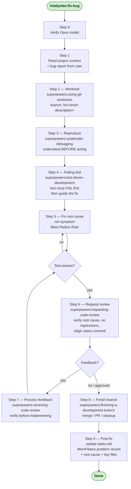

# fix-bug lifecycle

Test-first reproduction → root-cause fix → code review → branch merge.

```mermaid
flowchart TD
    A([/vladyslav:fix-bug]):::start
    A --> S0[Step 0<br/>Verify Opus model]
    S0 --> S1[Step 1<br/>Read project context<br/>+ bug report from user]
    S1 --> S2[Step 2 — Worktree<br/>superpowers:using-git-worktrees<br/>branch: fix/&lt;short-description&gt;]
    S2 --> S3[Step 3 — Reproduce<br/>superpowers:systematic-debugging<br/>understand BEFORE acting]
    S3 --> S4[Step 4 — Failing test<br/>superpowers:test-driven-development<br/>test must FAIL first<br/>then guide the fix]
    S4 --> S5[Step 5 — Fix root cause<br/>not symptom<br/>Blast Radius Rule]
    S5 --> S6{Test passes?}
    S6 -- no --> S5
    S6 -- yes --> S7[Step 6 — Request review<br/>superpowers:requesting-code-review<br/>verify root cause, no regressions,<br/>edge cases covered]

    S7 --> Q1{Feedback?}
    Q1 -- yes --> S8[Step 7 — Process feedback<br/>superpowers:receiving-code-review<br/>verify before implementing]
    S8 --> S6
    Q1 -- no / approved --> S9[Step 8 — Finish branch<br/>superpowers:finishing-a-development-branch<br/>merge / PR / cleanup]

    S9 --> S10[Step 9 — Post-fix<br/>update tasks.md<br/>MemPalace problem record<br/>+ root cause + key files]
    S10 --> END([Done]):::done

    classDef start fill:#d0f0d0,stroke:#006600,color:#003300,font-weight:bold
    classDef done fill:#d0f0d0,stroke:#006600,color:#003300,font-weight:bold
```
