# Skill Flows

Simplified lifecycle diagrams for all 18 skills. Render natively on GitHub.

---

## Setup Skills

### init-project — Bootstrap new project from scratch

```mermaid
flowchart LR
    A([/init-project]):::start --> B[Ask: name / stack\ndomain / private?]
    B --> C[Create dirs\n+ .gitignore]
    C --> D{Swift?}
    D -- yes --> E[xcodegen setup\nproject.yml + source files]
    D -- no --> F{Backend?}
    E --> F
    F -- python/go --> G[Backend files\nDockerfile + compose]
    F -- none --> H
    G --> H[CLAUDE.md + agents\n+ doc stubs]
    H --> I[Roadmap?\noptional — Step 9.5]
    I --> J[git init + commit]
    J --> K([Done → /analyze-project]):::done

    classDef start fill:#d0f0d0,stroke:#006600,color:#003300,font-weight:bold
    classDef done  fill:#d0f0d0,stroke:#006600,color:#003300,font-weight:bold
```

---

### attach-project — Add Claude structure to existing project

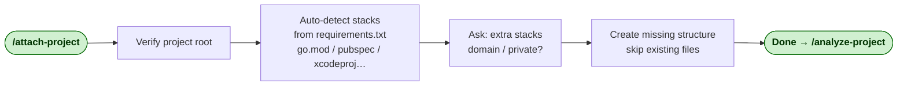

---

### analyze-project — Document codebase architecture

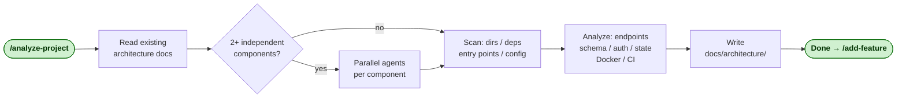

---

## Discover and Design Skills

### discover — AI research for competitors, monetization, valuation, marketing

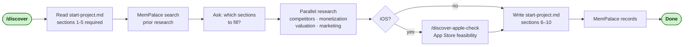

---

### design-sync — Canonize design tokens from existing codebase

```mermaid
flowchart LR
    A([/design-sync]):::start --> B[Verify UI project\nSwift / Flutter\nAndroid / Web]
    B --> C[Read existing\ndocs/design/system.md]
    C --> D[Scan codebase\ncolors · typography\nicons · spacing]
    D --> E[Detect drift\nduplicates / inconsistencies]
    E --> F[Present to user\ncanonize tokens]
    F --> G[Write\ndocs/design/system.md]
    G --> H[MemPalace\ndesign decisions]
    H --> I([Done]):::done

    classDef start fill:#d0f0d0,stroke:#006600,color:#003300,font-weight:bold
    classDef done  fill:#d0f0d0,stroke:#006600,color:#003300,font-weight:bold
```

---

### design-page — Generate UI screen from design system

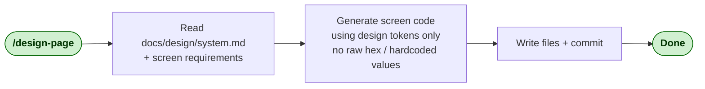

---

### seed-mempalace — Seed memory from existing project

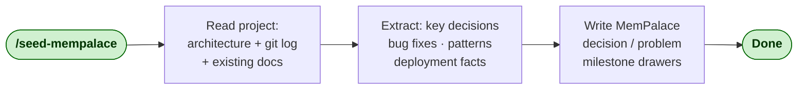

---

## Build Skills

### add-feature — Full feature lifecycle (design → plan → implement → merge)

```mermaid
flowchart LR
    A([/add-feature]):::start --> B[Read CLAUDE.md\narchitecture / PRD / tasks]
    B --> C[Get feature description]
    C --> D[Create worktree]
    D --> E[Brainstorm design]
    E --> AP1{{Approve design}}:::approval
    AP1 --> F[Define contract\ntypes + examples + errors]
    F --> AP2{{Approve contract}}:::approval
    AP2 --> G{Large feature?}
    G -- yes --> H[Generate roadmap\ndocs/roadmap/slug.md\nphases + done-when]
    G -- no  --> I[Write implementation plan]
    H --> I
    I --> AP3{{Approve plan}}:::approval
    AP3 --> J[Execute plan\nsubagents · parallel agents\nguard rails + auto-gate]
    J --> K[Code review]
    K --> L[Merge to dev]
    L --> M([Architect report\n→ /write-test-docs]):::done

    classDef start    fill:#d0f0d0,stroke:#006600,color:#003300,font-weight:bold
    classDef done     fill:#d0f0d0,stroke:#006600,color:#003300,font-weight:bold
    classDef approval fill:#fde7c2,stroke:#a87000,color:#5a3a00,font-weight:bold
```

---

### fix-bug — Full bug fix lifecycle (reproduce → fix → review → merge)

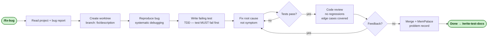

---

### swiftui-pro — SwiftUI-specific code review

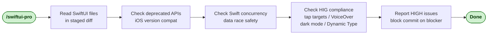

---

## Docs, Ship and Memory Skills

### write-user-stories — Generate user story registry

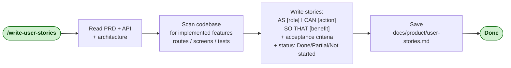

---

### write-test-docs — Generate test plan + manual QA checklist

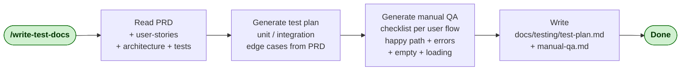

---

### write-project-docs — Generate README + onboarding + deployment docs

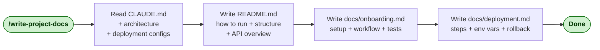

---

### pre-release-check — Final gate before production

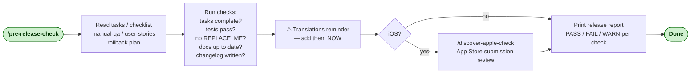

---

### stash — Pause and save mental state to MemPalace

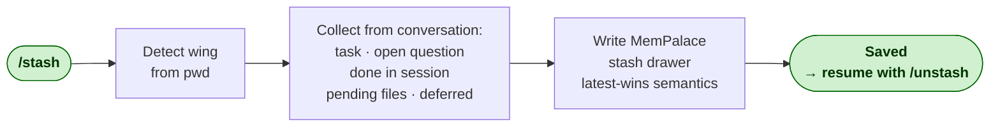

---

### unstash — Resume stashed task from MemPalace

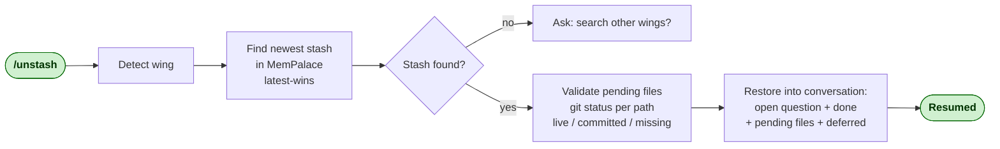
