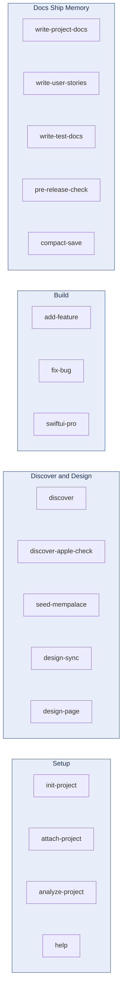

# Skills ecosystem

18 skills, grouped by lifecycle stage. Render natively on GitHub.

## Cluster meaning

- **Setup** — старт нового або підхоплення існуючого проекту, плюс довідник скілів
- **Discover and Design** — дослідження ринку, контракт продукту, design system, генерація екранів
- **Build** — лайфцикл фічі / багфіксу + iOS-специфічне ревю
- **Docs, Ship and Memory** — документація, фінальна верифікація перед релізом, кросс-сесійна пам'ять
