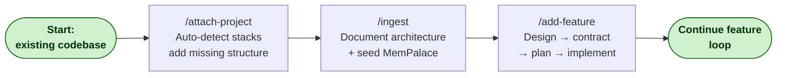
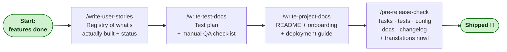
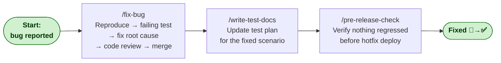
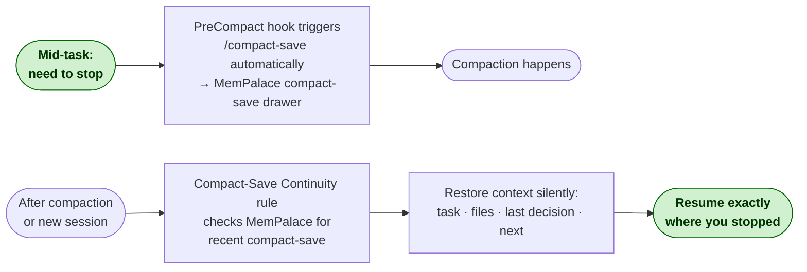
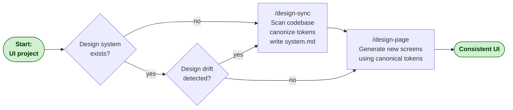

# Skill Workflows

Four recommended sequences for achieving results with vladyslav skills. Render natively on GitHub.

---

## New Project

From zero to first deployed feature.

```mermaid
flowchart LR
    A([Start:\nnew idea]):::start
    A --> B["/init-project\nBare AI shell (minimal)\nor opt-in modules (interactive)"]
    B --> C["/discover\nCompetitors / monetization\nvaluation / marketing"]
    C --> D["/ingest\nDocument architecture\nseeds MemPalace"]
    D --> E["/add-feature\nDesign → contract\n→ plan → implement"]
    E --> F["/write-test-docs\nTest plan\n+ manual QA"]
    F --> G["/write-project-docs\nREADME\n+ onboarding + deploy"]
    G --> H["/pre-release-check\nFinal gate\nbefore production"]
    H --> I([Shipped 🚀]):::done

    classDef start fill:#d0f0d0,stroke:#006600,color:#003300,font-weight:bold
    classDef done  fill:#d0f0d0,stroke:#006600,color:#003300,font-weight:bold
```

---

## Existing Project

Attach Claude Code to a project that already exists.

---

## Before Release

Final docs and verification before shipping.

---

## Bug Fix

Reproduce → fix root cause → verify → ship.

---

## Session Continuity

Pause and resume long-running work across sessions.

---

## Design System

Bootstrap or repair a consistent UI design system.

